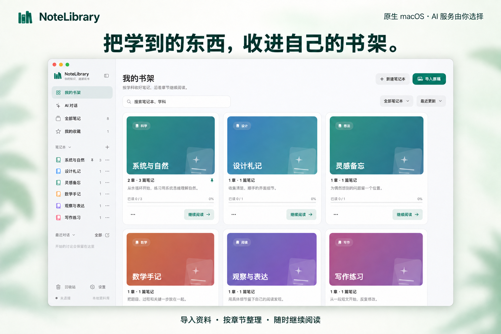
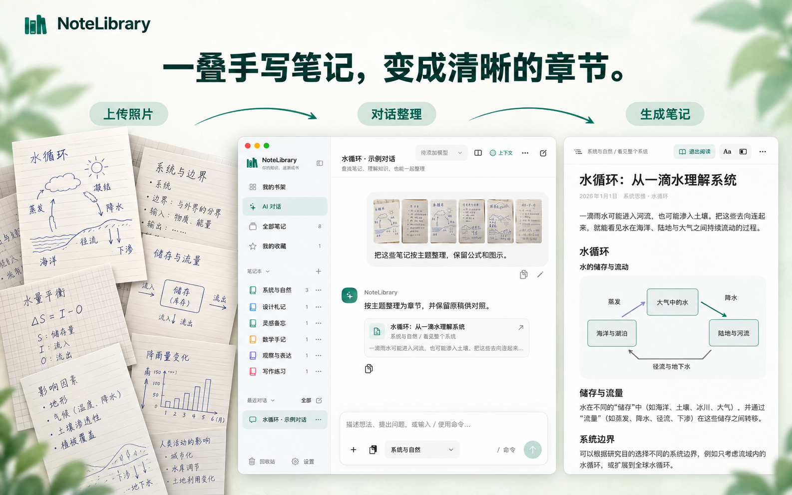
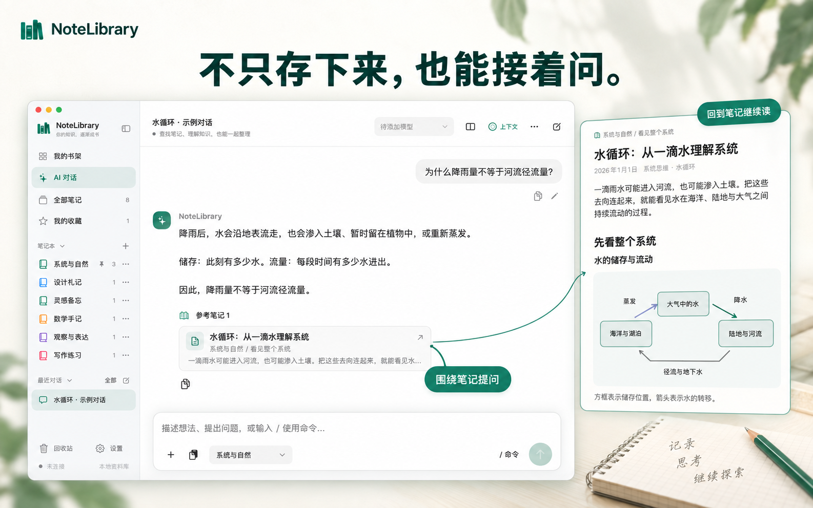
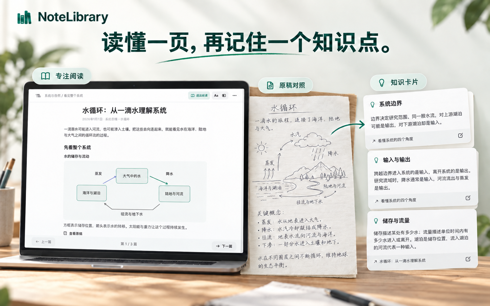
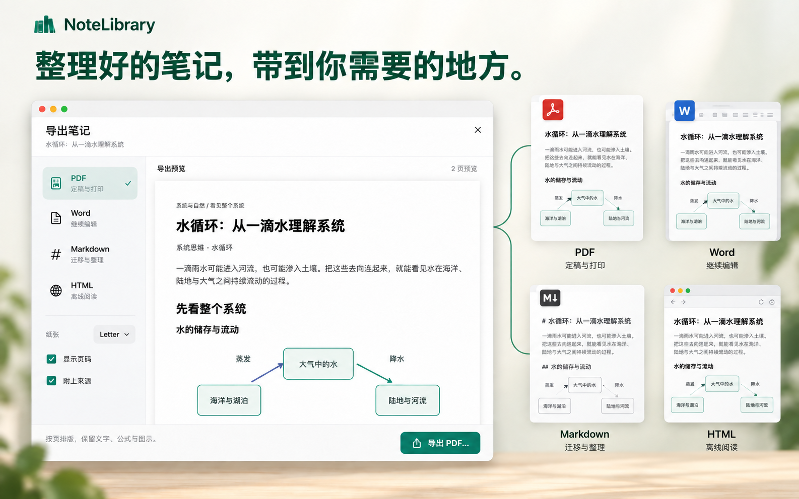
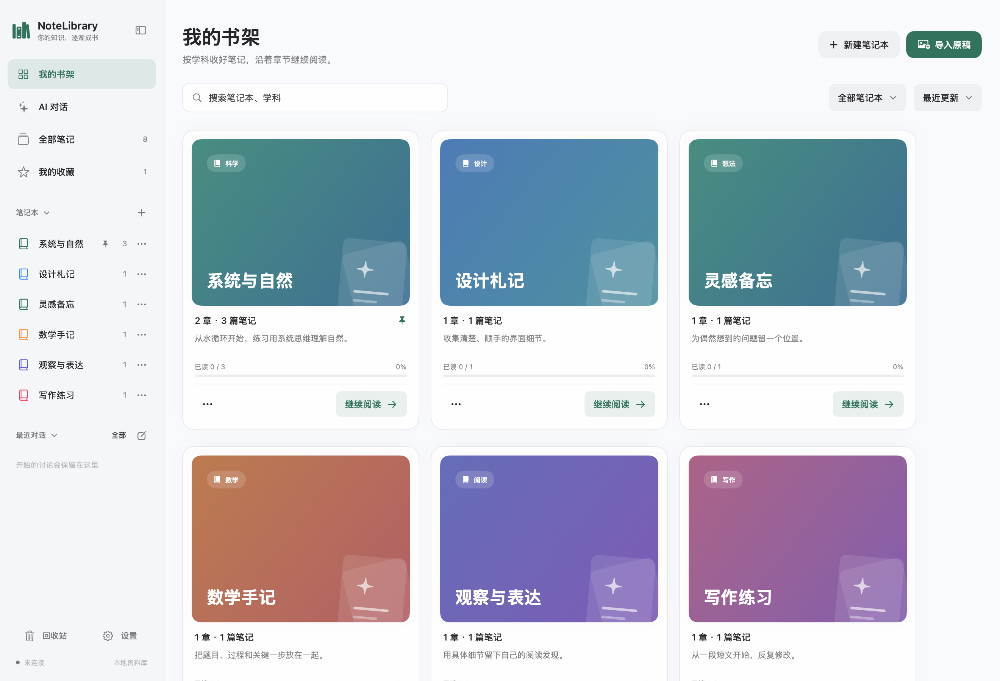
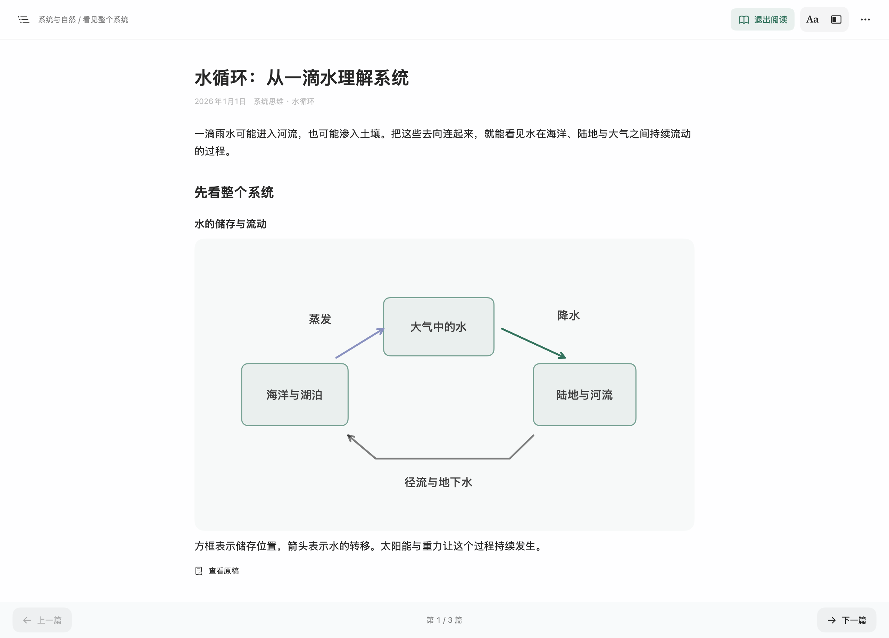
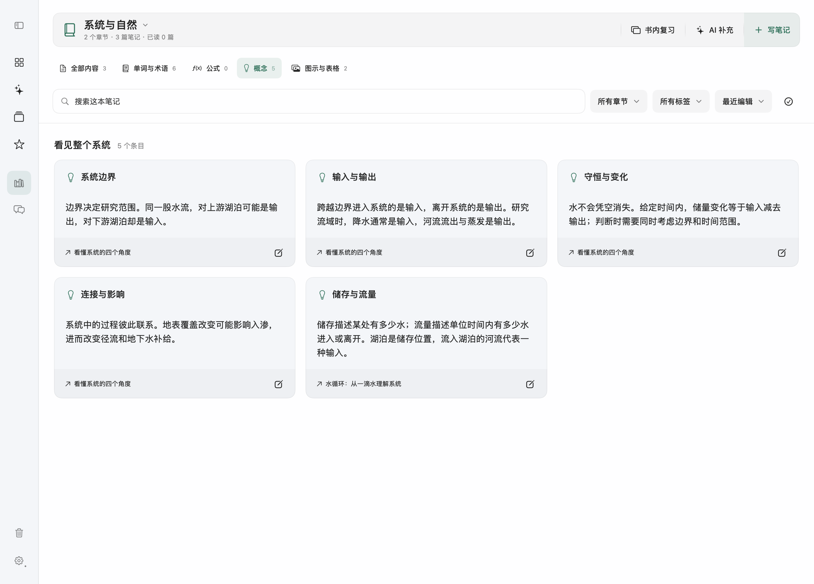
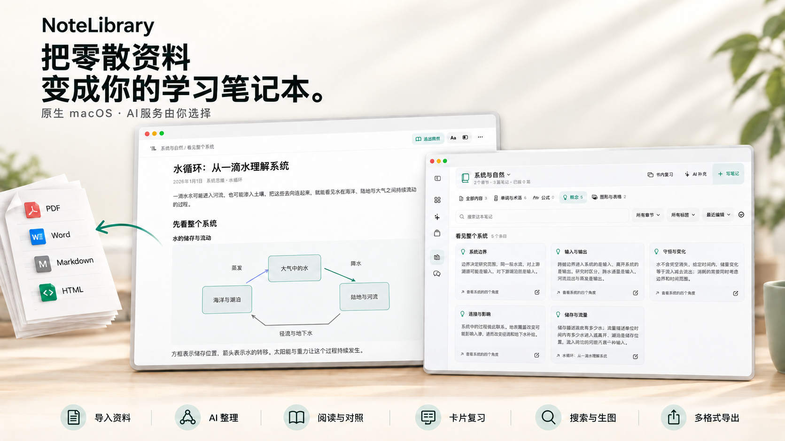

# NoteLibrary

**Turn your materials into study notebooks.**

Import a batch of notebook photos, tell AI how you want them organized, and save the result into chapters. Read alongside the originals, then switch to cards when it's time to review. NoteLibrary is a native macOS app built around that workflow.

[简体中文](README.md) · [Get started](#get-started) · [App previews](#app-previews) · [Contribute](CONTRIBUTING.md)

**macOS 15+ · Simplified Chinese interface · MIT · Source preview**



## From notebook photos to organized chapters

1. **Bring your material in.** Select several photos of handwritten notes and add them to one conversation. You can also import PDF, Word, PowerPoint, Markdown, and text.
2. **Say how you want to study it.** Give AI the subject, topic, and structure you want. Follow up with questions, ask for examples, or adjust the outline.
3. **Keep the result on your bookshelf.** Save the organized material as chapters and notes. Add new sources later, check an original, or search for the concept you need.



## Ask about what you're reading. Practice what you want to remember.

| Keep the conversation close to the material | Read and review in their own views |
| --- | --- |
| Ask AI to explain a passage, compare concepts, or add an example based on your notes. Connect web search when you need online sources. | Adjust the reader's type, spacing, and width, with the original source alongside it. Terms, formulas, concepts, and diagrams have separate cards; book review lets you recall an answer before revealing it. |
|  |  |

## Take your notes with you

Export a note as **PDF, Word, Markdown, or a self-contained HTML file**. Choose a format for printing, further editing, another tool, or reading in a browser.

<details>
<summary>View the export workflow</summary>



</details>

## Get started

Build this source preview with **Xcode 26.3 or later** on a Mac that meets Xcode's system requirements. The resulting app targets macOS 15 and later.

```sh
./scripts/build.sh
```

Open the `.app` at the path printed by the script. To work in Xcode, open `macOS/NoteLibrary.xcodeproj` and run the `NoteLibrary` scheme. An official notarized installer is not yet available.

Want to look around before setting up AI? Create a separate demo app with sample notebooks:

```sh
python3 scripts/make_demo.py .build/release/Build/Products/Release/NoteLibrary.app
```

Open the demo path printed by the command. Reading and review work without an API key, and the demo uses its own temporary library. See [demo details](Examples/README.md).

For AI features, add your service and model in **设置 → 服务与模型**, or use an available, signed-in local Codex installation. API usage is billed by your provider. The [setup guide](docs/GETTING_STARTED.md) walks through configuration and your first notebook.

## Choose the AI for the task

Use one model for conversation and another for reading images, organizing notes, checking content, or generating illustrations. Provider presets include OpenAI, DeepSeek, Claude, Gemini, Kimi, GLM, Qwen, Doubao, MiniMax, OpenRouter, and SiliconFlow; custom endpoints are supported too.

Configure Tavily or Brave to bring web sources into a conversation, and assign an image-capable model when you want to generate a picture. See [providers and supported protocols](docs/PROVIDERS.md) for setup choices and capability details.

## Your library, on your Mac

Notes, attachments, and review progress are saved locally. You can read, edit, search, and review without making an AI request. AI and web requests go to the services you configure.

[Privacy and key storage](PRIVACY.md) · [Exports and backups](docs/GETTING_STARTED.md#data-and-backups)

## App previews

These are renders of the app's native views using original demo content. The [asset notes](docs/assets/README.md) explain how the previews and product artwork were made.

<details>
<summary>View the bookshelf, reader, and review cards</summary>

### Bookshelf



### Reader



### Review cards



</details>

<details>
<summary>View the reading and review overview</summary>



</details>

## Help make it better

Try a sample, tell us where you got stuck, or contribute a fix. Document import examples, provider fixtures, accessibility improvements, and translations are especially useful. Please use synthetic material in public bug reports.

For development, run the offline tests with `./scripts/test.sh`. See [CONTRIBUTING.md](CONTRIBUTING.md) for the workflow and [the roadmap](docs/ROADMAP.md) for proposed next steps. If NoteLibrary belongs on your Mac, a star is welcome.

## License

[MIT](LICENSE). Bundled dependencies and assets retain their own licenses; see [third-party notices](THIRD_PARTY_NOTICES.md).
